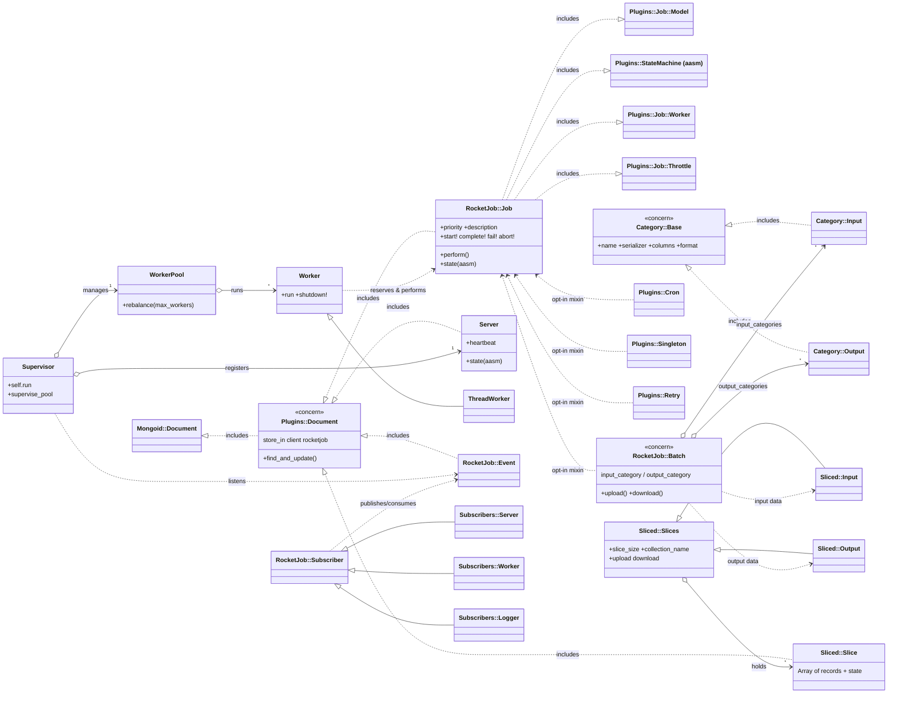

# Contributing

Welcome to Rocket Job, great to have you on-board. :tada:

To get you started here are some pointers.

## Questions

Please do not open issues for questions, use the discussions feature in Github:
https://github.com/reidmorrison/rocketjob/discussions

## Open Source

#### Early Adopters

Great to have you onboard, looking forward to your help and feedback.

#### Late Adopters

Rocket Job is open source, maintained by the author and contributors in their spare time and offered to the
community free of charge. Please keep that in mind when raising issues or requesting features, since there is
no dedicated team available to take on custom work on demand.

If you have a specific need, particularly an edge case that is unique to your own environment or job, the
best way forward is to implement it yourself and open a Pull Request. Contributions of this kind are exactly
how the project grows, and they are warmly welcomed and appreciated.

## Documentation

Documentation updates are welcome and appreciated by all users of Rocket Job.

The documentation is a Jekyll site under the `docs` subdirectory, published to [rocketjob.io](https://rocketjob.io).

#### Small changes

For a quick and fairly simple documentation fix the changes can be made entirely online in github.

1. Fork the repository in github.
2. Look for the markdown file that matches the documentation page to be updated under the `docs` subdirectory.
3. Click Edit.
4. Make the change and select preview to see what the changes would look like.
5. Save the change with a commit message.
6. Submit a Pull Request back to the Rocket Job repository.

#### Complete Setup

To make multiple changes to the documentation, add new pages or just to have a real preview of what the
documentation would look like locally after any changes.

1. Fork the repository in github.
2. Clone the repository to your local machine.
3. Change into the documentation directory.

       cd rocketjob/docs

4. Install required gems

       bundle update

5. Start the Jekyll server

       jekyll s

6. Open a browser to: http://127.0.0.1:4000

7. Navigate around and find the page to edit. The url usually lines up with the markdown file that
   contains the corresponding text.

8. Edit the files ending in `.md` and refresh the page in the web browser to see the change.

9. Once changes are complete commit the changes.

10. Push the changes to your forked repository.

11. Submit a Pull Request back to the Rocket Job repository.

#### Conventions

New and updated pages follow a few conventions so the site stays consistent:

* Markdown is rendered with [kramdown](https://kramdown.gettalong.org). Generate the table of
  contents automatically instead of maintaining it by hand: start the page with a `{:.no_toc}`
  heading, followed by a `**Contents**` line and a `* TOC` / `{:toc}` block. See `index.md` or
  `guide.md` for the pattern.
* Use tilde code fences (`~~~ruby`, `~~~bash`, `~~~yaml`), not triple backticks.
* Link between pages with inline relative links to the rendered `.html`, for example
  `[Batch Guide](batch.html)`.
* Avoid em dashes in prose. Use commas, colons, parentheses, or separate sentences instead.
* When renaming a page, preserve the old URL by adding a `redirect_from` entry to the new page's
  front matter. The `jekyll-redirect-from` plugin is enabled in `_config.yml`.

## Code Changes

Since changes cannot be made directly to the Rocket Job repository, fork it to your own account on Github.

1. Fork the repository in github.
2. Clone the repository to your local machine.
3. Change into the Rocket Job directory.

       cd rocketjob

4. Install required gems

       bundle update

5. Rocket Job stores everything in MongoDB, so the tests need a running MongoDB. The quickest way to provide
   one is to start the container defined in `docker-compose.yml`:

       docker compose up -d

   By default the tests connect to `127.0.0.1:27017` (see `test/config/mongoid.yml`).

6. Run the tests

       bundle exec rake test

7. Run the linter

       bundle exec rubocop

   The minimum supported Ruby is 3.2, so please do not use syntax newer than that under `lib`.

8. When making a bug fix it is recommended to update the test first, ensure the test fails, and only then
   make the code fix.

9. Once the tests pass and all code changes are complete, commit the changes.

10. Push changes to your forked repository.

11. Submit a Pull Request back to the Rocket Job repository.

### Full Testing

The steps above use the packages in `Gemfile`. The full suite runs against every supported combination of
Mongoid, ActiveRecord, and Ruby. [Appraisal](https://github.com/thoughtbot/appraisal) manages the multiple
gemfiles, which are defined in `Appraisals` and generated into the `gemfiles` folder.

Install all the gemsets needed to run the tests (also regenerates the files in `gemfiles`):

    bundle exec appraisal install

Run the tests for all supported versions:

    bundle exec rake

Or for one specific version:

    bundle exec appraisal mongoid_9.1 rake test

Or one particular test file:

    bundle exec appraisal mongoid_9.1 ruby -Itest test/job_test.rb

Or down to one test case:

    bundle exec appraisal mongoid_9.1 ruby -Itest test/job_test.rb -n "/requeue_dead_server/"

## Philosophy

Rocket Job is **Ruby's missing batch system**. Ordinary background job frameworks run one small task per
worker, which is fine for sending an email or resizing an image. Rocket Job was built when that model could
not keep up: processing very large files for a large credit bureau, spread across thousands of concurrent
workers (often Docker containers). Sidekiq, backed by Redis, could not scale to that, because Redis was
single threaded and could not overflow to disk when memory filled up.

This leads to two tiers of jobs:

- **Simple jobs** inherit from `RocketJob::Job` and provide the conventional "run this task in the
  background" capability that other frameworks also offer.
- **Batch jobs** mix in `RocketJob::Batch`, and are where the real power lies. A single logical job uploads
  all of its input into a dynamically created MongoDB collection, which is split into *slices* that thousands
  of workers process concurrently. Output is written back into MongoDB the same way. Because the data lives in
  MongoDB rather than in worker memory, jobs processing very large files keep working even when the data far
  exceeds available RAM.

Two design decisions follow directly from this:

- **MongoDB as the datastore.** Its atomic `find_and_modify` lets thousands of nodes claim work without
  stepping on each other, and it transparently spills from memory to disk, which is essential for very large
  batch jobs. Rocket Job also runs on AWS DocumentDB.
- **Mongoid as the model layer.** Jobs are Mongoid documents, so every job field has a real, declared data
  type with validations and type checking, instead of the untyped hash of arguments most job frameworks pass
  around.

**Backward compatibility is a priority.** It should only be broken in a major release, and ideally only after
a deprecation path has been offered first. In practice, most forced changes come from breaking changes in
MongoDB or Mongoid rather than from choices made here.

## Architecture

### Public vs internal API

The public interface is small and deliberately so. Application code subclasses `RocketJob::Job`, optionally
mixes in capability modules such as `RocketJob::Batch`, defines typed fields, and implements `#perform`.
Queuing, downloading results, and the documented job state transitions round out the surface that is
guaranteed to remain stable.

Everything else, the plugin modules under `RocketJob::Plugins`, the slicing machinery under
`RocketJob::Sliced`, and the runtime classes (`Supervisor`, `Server`, `WorkerPool`, `Worker`,
`Subscriber`), is internal. It is documented here for contributors extending Rocket Job, not for callers
using it, and may change between minor releases as long as the public job interface is preserved.

### Jobs are built from plugins

`RocketJob::Job` is intentionally almost empty: it composes its behavior by including a stack of modules
(`Plugins::Document`, `Plugins::Job::Model`, `Persistence`, `Callbacks`, `Logger`, `StateMachine`, `Worker`,
`Throttle`, ...). `Plugins::Document` is the concern that pulls in `Mongoid::Document` and pins the job to the
`rocketjob` MongoDB client. State transitions (`queued -> running -> completed/failed/aborted/paused`) are
driven by the `aasm` gem via the state machine plugins.

Optional capabilities are themselves modules that a job opts into: `Batch`, `Cron`, `Singleton`, `Retry`,
`ProcessingWindow`, `Transaction`, and `ThrottleDependentJobs`.

### Batch jobs and slices

`RocketJob::Batch` is a concern that layers slicing on top of a job. Input and output are organized into
**categories** (`Category::Input` / `Category::Output`), each with its own serializer (plain, compressed,
encrypted, bzip2) and collection. The data itself is stored separately from the job in the `rocketjob_slices`
MongoDB client: `Sliced::Input` and `Sliced::Output` (both subclasses of `Sliced::Slices`) manage
dynamically created collections of `Sliced::Slice` documents, each holding a batch of records for one worker
to process.

### Runtime: Supervisor, Server, Workers

A running process is driven by the `Supervisor`, started via `bin/rocketjob` (`RocketJob::CLI`). It registers
a `Server` document, manages a `WorkerPool` of `Worker` threads (`ThreadWorker`), handles OS signals, and
runs the listeners. Cross-process coordination (shutdown,
pause, log-level changes) does not use a separate broker: it rides on MongoDB through `RocketJob::Event` and
the `Subscriber` / `Subscribers::*` classes.

### Class diagram

The diagram leaves out the smaller pieces (the remaining `Plugins::Job::*` modules, the serializer-specific
slice classes such as `EncryptedSlice` and `BZip2OutputSlice`, the built-in jobs under `RocketJob::Jobs`, and
`Subscribers::SecretConfig`) to keep it legible. They follow the same patterns as the classes shown.

### Adding a job plugin

A plugin is an `ActiveSupport::Concern` under `lib/rocket_job/plugins/` that a job includes to gain a
capability. Use the `included do ... end` block to declare fields (with real Mongoid types), validations, and
state machine callbacks. Register the class in the `autoload` list in `lib/rocketjob.rb`. If the plugin adds
persisted fields, remember that backward compatibility matters: existing jobs in the database must still load,
so give new fields sensible defaults rather than making them required.

## Contributor Code of Conduct

As contributors and maintainers of this project, and in the interest of fostering an open and welcoming community, we pledge to respect all people who contribute through reporting issues, posting feature requests, updating documentation, submitting pull requests or patches, and other activities.

We are committed to making participation in this project a harassment-free experience for everyone, regardless of level of experience, gender, gender identity and expression, sexual orientation, disability, personal appearance, body size, race, ethnicity, age, religion, or nationality.

Examples of unacceptable behavior by participants include:

* The use of sexualized language or imagery
* Personal attacks
* Trolling or insulting/derogatory comments
* Public or private harassment
* Publishing other's private information, such as physical or electronic addresses, without explicit permission
* Other unethical or unprofessional conduct.

Project maintainers have the right and responsibility to remove, edit, or reject comments, commits, code, wiki edits, issues, and other contributions that are not aligned to this Code of Conduct. By adopting this Code of Conduct, project maintainers commit themselves to fairly and consistently applying these principles to every aspect of managing this project. Project maintainers who do not follow or enforce the Code of Conduct may be permanently removed from the project team.

This code of conduct applies both within project spaces and in public spaces when an individual is representing the project or its community.

Instances of abusive, harassing, or otherwise unacceptable behavior may be reported by opening an issue or contacting one or more of the project maintainers.

This Code of Conduct is adapted from the [Contributor Covenant](http://contributor-covenant.org), version 1.2.0, available at [http://contributor-covenant.org/version/1/2/0/](http://contributor-covenant.org/version/1/2/0/)
