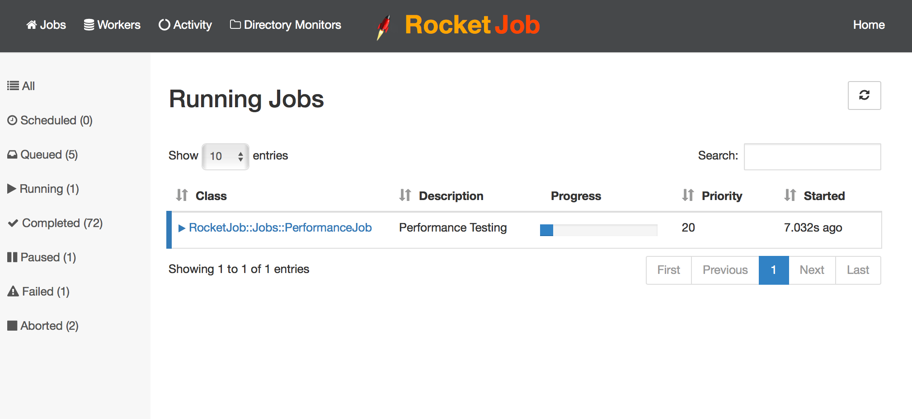
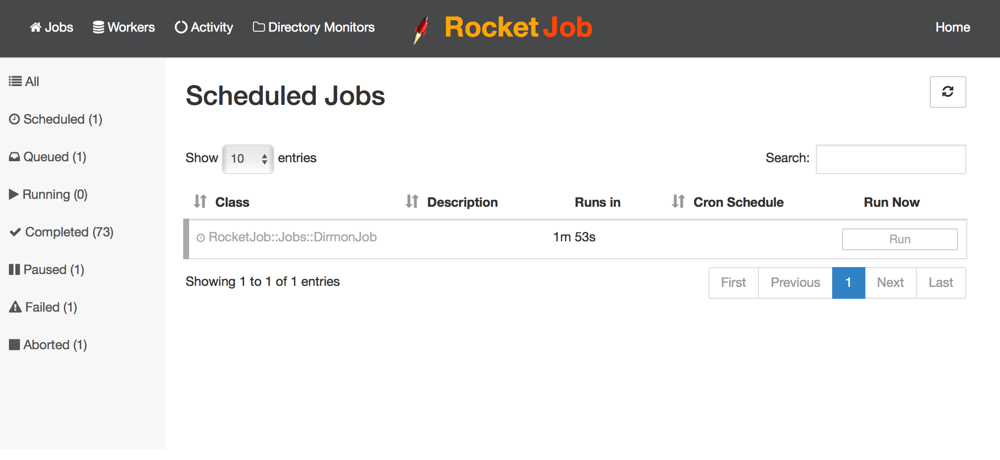

## What is Rocket Job?
{:.no_toc}

**Contents**

* TOC
{:toc}

Rocket Job is a distributed, priority-based background job and batch processing system for Ruby.

It is built to do two things that ordinary background job frameworks struggle with:

1. **Run conventional background jobs reliably, in business priority order.** A job is a real
   Ruby class with typed, validated fields. It is persisted to MongoDB, picked up by any
   available worker, and processed in priority order so that business-critical work jumps ahead
   of routine work. Every job is tracked from the moment it is queued until it completes, fails,
   or is aborted.
2. **Process a single huge workload across thousands of workers at once.** Add one line,
   `include RocketJob::Batch`, and a job's input is uploaded into MongoDB, split into small
   *slices*, and processed concurrently across every available worker. A file with millions of
   rows becomes thousands of bite-size slices that run in parallel and can be paused, resumed,
   retried, or aborted as a whole.

The same framework covers both the small recurring job and the multi-gigabyte file import, with
one programming model and one place to watch it all run.

## Why use it?

### The problem with ordinary background jobs

Most Ruby background job frameworks were designed for one thing: run a short method, soon, on one
worker. That works until your needs grow past it:

* You need to process a file with ten million rows. One worker grinding through it for hours is
  not an option, and Redis-backed queues cannot spill that much data to disk.
* You need business-critical work to preempt routine work, not just sit in the same FIFO queue.
* You pass arguments as an untyped array or hash, with no validation, so a malformed job is only
  discovered when it blows up mid-run.
* When a job fails at row 4,000,000, you want to retry just the failed slice, not start over.
* You want to *see* what is queued, running, and failed, and change a job's priority or retry it,
  without shelling into a console.

### Is Rocket Job the right fit?

If you need conventional background jobs (send an email, update a record) and nothing more, a
Redis-backed queue like Sidekiq or a database-backed one like Solid Queue will be simpler to
operate, and your Rails app may already include one.

Rocket Job is worth adding when your work outgrows that model:

* You process files with millions of records and want them handled in parallel across many workers,
  not ground through one at a time.
* You need jobs to run in strict business-priority order, with critical work preempting routine
  work.
* You want to retry a single failed slice of a large job rather than restarting the whole thing.

It is built for the large-batch, high-priority end of the spectrum, and it runs ordinary jobs
perfectly well too.

### The Rocket Job way

A job is an ordinary class with real fields:

~~~ruby
class ImportJob < RocketJob::Job
  field :file_name, type: String

  validates_presence_of :file_name

  def perform
    # Import the file ...
  end
end
~~~

~~~ruby
ImportJob.create!(file_name: "users.csv", priority: 5)
~~~

That single `create!` validates the fields, persists the job to MongoDB, and queues it. Any worker
on any server can pick it up. Because `priority: 5` is well above the default of 50, it jumps ahead
of routine work.

To turn the very same job into one that processes a large file across every available worker, you
add one module and accept a record per call:

~~~ruby
class ImportJob < RocketJob::Job
  include RocketJob::Batch

  def perform(row)
    # Called once per row, spread across all workers
    User.create!(row)
  end
end
~~~

~~~ruby
job = ImportJob.new
job.upload("users.csv")
job.save!
~~~

The file is uploaded into MongoDB, sliced, and processed in parallel. Nothing else in the job
changed.

### See everything running

Rocket Job ships with a web interface,
[Rocket Job Mission Control](mission_control.html), so queued, running, scheduled, completed, and
failed jobs are all visible, and you can change priority, retry, pause, or abort them from the
browser.

Scheduled jobs replace cron, with full visibility into what is scheduled and when it last ran:

### Reasons developers choose Rocket Job

* **Scales from one worker to thousands.** Batch jobs split work into slices that thousands of
  workers, often across hundreds of containers, claim and process concurrently. See
  [how it works](#how-it-works).
* **Priority based.** Jobs run in business priority order (1 is highest, 50 the default), and a
  high-priority job will interrupt a running batch job to get resources, then let it resume.
* **Built for very large files.** Input is uploaded into MongoDB, which spills from memory to disk,
  so files far larger than RAM are processed without a separate data store. Built-in support for
  Zip, GZip, encrypted, delimited, and fixed-length files.
* **Typed, validated jobs.** Fields have real types and validations instead of an untyped argument
  hash, so a bad job is rejected at `create!` time, not mid-run.
* **Reliable and resumable.** Every job and every slice is tracked. Failed slices keep their
  exception and can be retried on their own; whole jobs can be paused, resumed, or aborted.
* **A familiar, ActiveRecord-like API.** `create!`, `field`, `validates`, queries, and callbacks
  all feel like Rails models, because jobs are Mongoid documents.
* **Cron without a cron server.** Schedule recurring jobs with a `cron_schedule`; there is no
  central scheduler to keep alive and no missed runs when one box is down.
* **Visible in production.** The web interface, plus high-performance structured logging via
  [Semantic Logger](https://logger.rocketjob.io), make it easy to operate.

## Quick start

Rocket Job runs with or without Rails. This is the shortest path to a running job. The
[Installation guide](installation.html) covers Rails, standalone, and the web interface in full.

### 1. Start MongoDB

Rocket Job stores all job data in [MongoDB](https://mongodb.com). The easiest way to run it locally
is Docker:

~~~bash
docker run --name rocketjob_mongo -p 27017:27017 -d mongo:6.0
~~~

### 2. Install the gem

~~~ruby
# Gemfile
gem "rocketjob"
~~~

~~~bash
bundle install
~~~

### 3. Configure MongoDB

Rocket Job needs two MongoDB clients: `rocketjob` for the jobs themselves and `rocketjob_slices`
for batch slice data. In a standalone setup, create `config/mongoid.yml`:

~~~yaml
development:
  clients:
    default: &default_development
      uri: mongodb://127.0.0.1:27017/rocketjob_development
    rocketjob:
      <<: *default_development
    rocketjob_slices:
      <<: *default_development
~~~

See the [Installation guide](installation.html) for the full production-ready configuration.

### 4. Write a job

Create `jobs/hello_world_job.rb`:

~~~ruby
class HelloWorldJob < RocketJob::Job
  def perform
    puts "Hello World"
  end
end
~~~

### 5. Start a worker

~~~bash
bundle exec rocketjob
~~~

### 6. Queue the job

From a console (`bundle exec irb`):

~~~ruby
require "rocketjob"
RocketJob::Config.load!("development", "config/mongoid.yml")
require_relative "jobs/hello_world_job"

HelloWorldJob.create!
~~~

The worker process picks up the job and logs something like:

~~~
I [job:5731...] HelloWorldJob -- Start #perform
Hello World
I [job:5731...] (0.120ms) HelloWorldJob -- Completed #perform
~~~

That is the whole loop: define a job, start a worker, queue the job. The
[Programmer's Guide](guide.html) covers the full API.

## A tour of the features

### Add typed fields

Give a job real, typed input. Fields are validated and persisted like ActiveRecord attributes.

~~~ruby
class ReportJob < RocketJob::Job
  field :username,   type: String
  field :start_date, type: Date, default: -> { Date.today }

  validates_presence_of :username

  def perform
    logger.info "Building report for #{username} from #{start_date}"
  end
end
~~~

~~~ruby
ReportJob.create!(username: "jbloggs")
~~~

### Set business priority

Lower numbers run first. The default is 50; this one jumps the queue:

~~~ruby
ReportJob.create!(username: "jbloggs", priority: 5)
~~~

### Delay until later

~~~ruby
ReportJob.create!(username: "jbloggs", run_at: 2.hours.from_now)
~~~

### Run on a schedule (cron replacement)

Mix in the `Cron` plugin and set a schedule. When the job completes it automatically re-schedules
its next run, with no separate cron daemon to keep alive.

~~~ruby
class NightlyReportJob < RocketJob::Job
  include RocketJob::Plugins::Cron

  # Run at 1am UTC every day
  self.cron_schedule = "0 1 * * * UTC"

  def perform
    # ...
  end
end
~~~

~~~ruby
NightlyReportJob.create!
~~~

### Hook into the lifecycle with callbacks

~~~ruby
class ImportJob < RocketJob::Job
  after_start :notify_started

  def perform
    # ...
  end

  def notify_started
    ImportMailer.started(self).deliver_now
  end
end
~~~

### Process a large file as a batch job

This is what sets Rocket Job apart. Include `RocketJob::Batch`, write a `perform` that handles a
single record, and upload a file. Rocket Job slices the file and runs the slices across every
available worker in parallel.

~~~ruby
class ReverseJob < RocketJob::Job
  include RocketJob::Batch

  # Keep the job after it finishes so the output can be downloaded
  self.destroy_on_complete = false

  # 100 lines per slice (the default)
  input_category slice_size: 100

  # Collect the return value of every perform call as output
  output_category

  def perform(line)
    line.reverse
  end
end
~~~

Upload a file and queue it. The file can be plain text, GZip, Zip, or encrypted; Rocket Job
detects and decompresses it before slicing:

~~~ruby
job = ReverseJob.new
job.upload("input.txt")
job.save!
~~~

Once it completes, download the combined output, optionally compressed on the way out:

~~~ruby
job.download("reversed.txt.gz")
~~~

Because the work is sliced, a single job can be paused, resumed, or aborted, and if any slices
failed you retry just those by retrying the job. The [Batch Guide](batch.html) covers multiple
output files, tabular (CSV/JSON/etc.) parsing, throttling, and error handling.

### Trigger jobs when files arrive

The built-in directory monitor, [Dirmon](dirmon.html), watches directories and automatically
queues a job for each new file that appears, so an upload can kick off a batch import with no glue
code.

## How it works

A Rocket Job server process (started with `bundle exec rocketjob`) registers itself in MongoDB and
runs a pool of worker threads. Each worker repeatedly asks MongoDB for the highest-priority job
that is ready to run, using an atomic `find_and_modify` so that thousands of workers across many
servers can claim work without ever colliding or running the same job twice. There is no separate
message broker: MongoDB is both the queue and the system of record.

For a **simple job**, one worker claims the whole job, runs `perform`, and records the result. Many
workers share the same queue, so each job is picked up by whichever worker is free next:

~~~mermaid
flowchart LR
    j1["job"] --> queue[("MongoDB queue (priority order)")]
    j2["job"] --> queue
    j3["job"] --> queue
    queue -- find_and_modify --> worker1["worker"]
    queue -- find_and_modify --> worker2["worker"]
    queue -- find_and_modify --> workerN["worker"]
~~~

For a **batch job**, the input you upload is stored in a dedicated MongoDB collection and divided
into slices. Each slice is an independent unit of work that any worker can claim:

~~~mermaid
flowchart LR
    input["input file"] --> slices["slices"]
    slices --> worker1["worker"]
    slices --> worker2["worker"]
    slices --> worker3["worker"]
    slices --> workerN["worker"]
    worker1 -- slice 1 --> output["output collection"]
    worker2 -- slice 2 --> output
    worker3 -- slice 3 --> output
    workerN -- slice N --> output
    output --> download["download"]
~~~

This is why Rocket Job scales the way it does: adding workers (more threads, more servers, more
containers) simply means more slices are processed at once. MongoDB's ability to spill from memory
to disk is what lets a single job hold millions of records of input and output without exhausting
memory or needing a separate data store. A slice carries its own state, so a failure is isolated to
that slice, retains the exception that caused it, and can be retried on its own.

Because everything lives in MongoDB, the [web interface](mission_control.html) can show the live
state of every job and slice, and operators can re-prioritize, retry, pause, or abort work while it
runs.

## Compatibility

Rocket Job is tested against a matrix of Ruby, Mongoid, and Rails versions:

* **Ruby:** MRI 3.2, 3.4, and 4.0 are exercised in CI; JRuby 9.4 or newer is also supported. The
  authoritative list is the [CI matrix](https://github.com/reidmorrison/rocketjob/blob/master/.github/workflows/ci.yml).
* **Mongoid:** 8.1, 9.0, and 9.1, as defined in
  [Appraisals](https://github.com/reidmorrison/rocketjob/blob/master/Appraisals).
* **Rails / Active Record:** 7.2, 8.0, and 8.1, each paired with the Mongoid versions above (also
  in `Appraisals`). Rails is optional; Rocket Job runs equally well standalone.
* **MongoDB server:** whatever your Mongoid version supports. Mongoid 8.1 through 9.1 currently
  support MongoDB server 3.6 through 8.x; see the
  [Mongoid compatibility matrix](https://www.mongodb.com/docs/mongoid/current/compatibility/).

These are the combinations run in CI. See
[ci.yml](https://github.com/reidmorrison/rocketjob/blob/master/.github/workflows/ci.yml) and
[Appraisals](https://github.com/reidmorrison/rocketjob/blob/master/Appraisals) for the current,
authoritative list.

## Next steps

* [Installation](installation.html): Rails, standalone, and the web interface.
* [Programmer's Guide](guide.html): the full job API, fields, scheduling, throttling, and callbacks.
* [Batch Guide](batch.html): large files, tabular data, and parallel processing in depth.
* [Mission Control](mission_control.html): the web interface.
* [Dirmon](dirmon.html): trigger jobs from arriving files.
