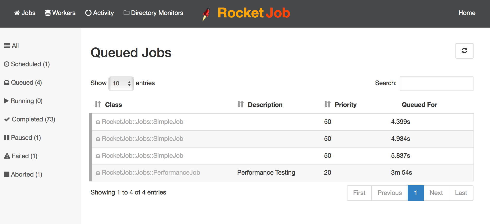
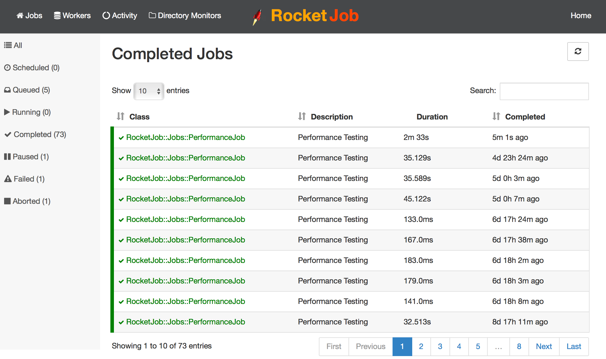
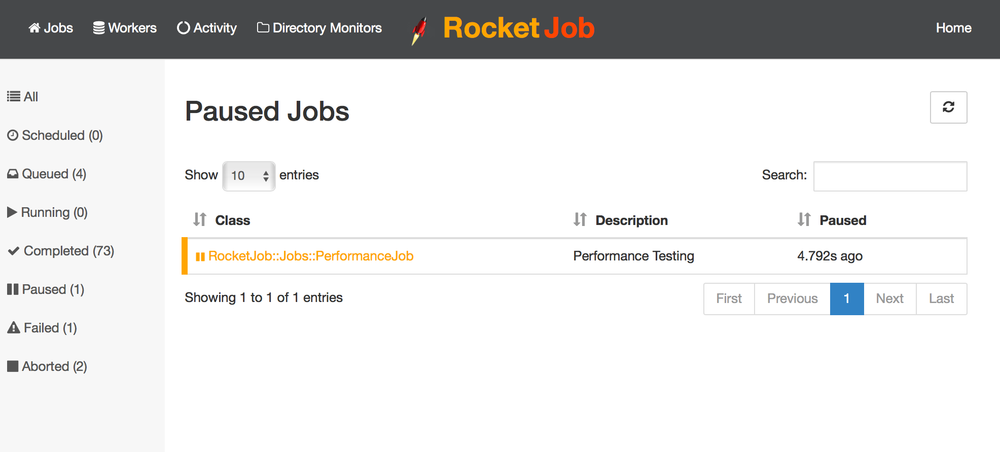
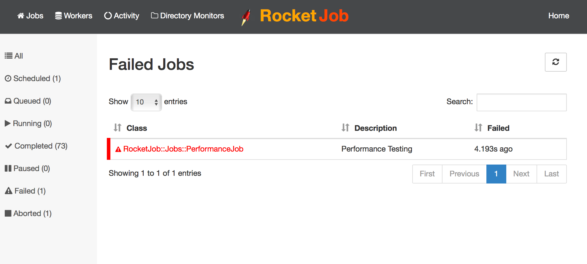
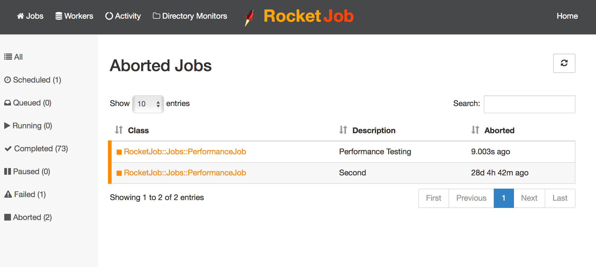
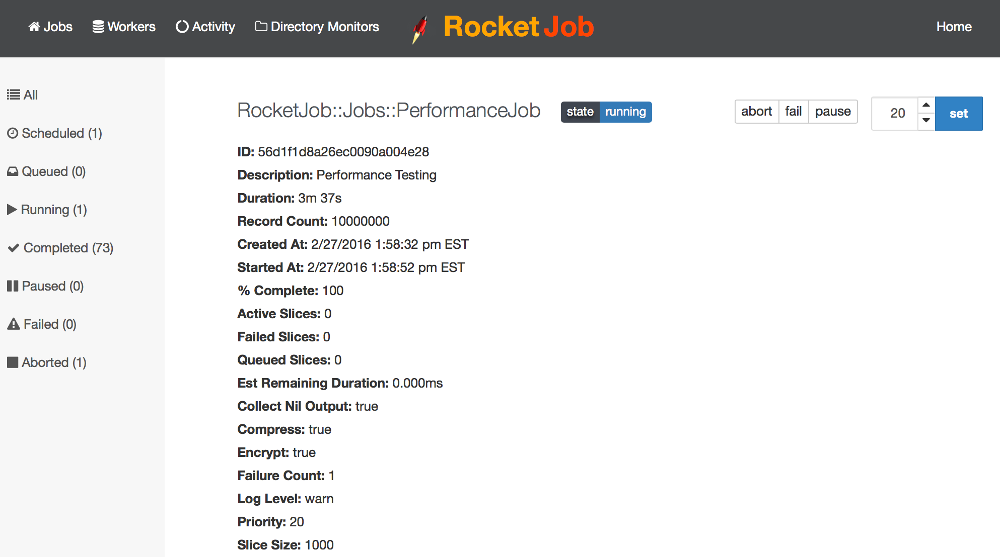
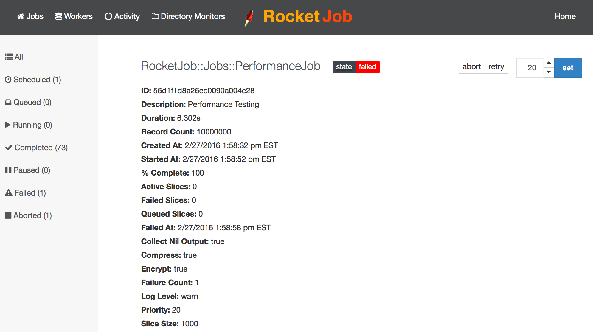
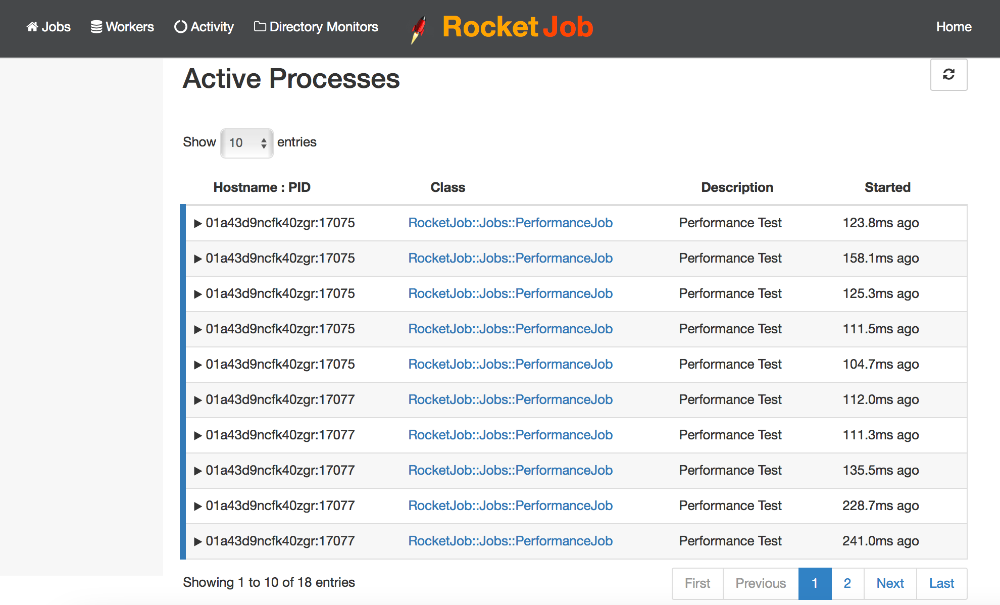
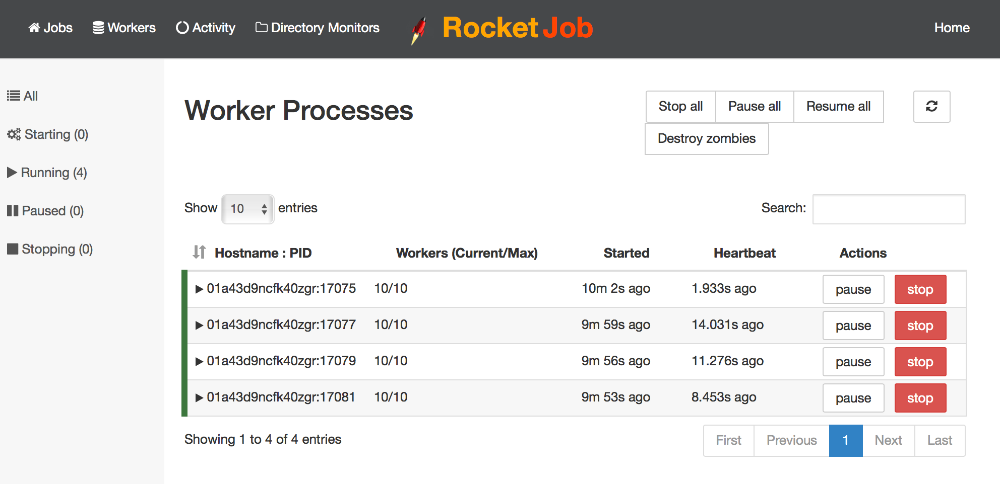

## Mission Control: The Web UI
{:.no_toc}

**Contents**

* TOC
{:toc}

Rocket Job Mission Control is the web interface for managing and monitoring Rocket Job.
It lets operators see what every job is doing, retry or abort work, pace the cluster, and
manage [directory monitoring](dirmon.html) entries, all without writing or deploying any
code.

It ships as a separate gem, [`rocketjob_mission_control`](https://github.com/reidmorrison/rocketjob_mission_control),
so the web UI and its Rails dependencies are not loaded everywhere Rocket Job jobs are
defined or run. Workers stay lean; the console runs wherever it is convenient to host a
small Rails app.

### Installation

Mission Control is a Rails engine. Mount it into a new or existing Rails application.

Add it to the `Gemfile`:

~~~ruby
gem "rocketjob_mission_control", "~> 6.0"
~~~

Install it:

~~~bash
bundle install
~~~

Mount the engine in `config/routes.rb`, pointing it at whatever path you want it served
from:

~~~ruby
Rails.application.routes.draw do
  mount RocketJobMissionControl::Engine => "rocketjob"
end
~~~

The application that hosts Mission Control needs the same Mongoid configuration as the
rest of the cluster (the `rocketjob` and `rocketjob_slices` clients) so that it reads and
writes the same jobs and slices. See [Installation](installation.html) for the Mongoid
setup.

Mission Control is a Rails engine and only needs `railties`; it does not require a full
Rails stack, so it can be mounted into a minimal app dedicated to operations. Because it
exposes destructive actions (aborting jobs, stopping servers), put it behind your own
authentication and authorization before exposing it outside a trusted network.

### Monitoring jobs

The interface opens on the list of running jobs, newest first. Each entry shows:

* The class name of the job.
* An icon indicating the job's state.
* A duration that means different things depending on state:
    * **Completed:** how long the job took to run.
    * **Queued:** how long it has been waiting.
    * **Running:** how long it has been processing.
    * **Failed or aborted:** how long it ran before it stopped.
* For running jobs, a progress bar showing percent complete.

Jobs are grouped by state, each on its own tab:

* **Running** is the default view.

  

* **Scheduled** lists jobs set to run in the future, including recurring
  [Cron jobs](guide.html). Select **Run** on any scheduled job to run it immediately
  instead of waiting for its next scheduled time.

  

* **Queued** lists jobs waiting for a free worker.

  

* **Completed** lists finished jobs. Only jobs with `destroy_on_complete == false` are kept
  and shown here; by default completed jobs delete themselves.

  

* **Paused** lists jobs whose processing has been temporarily stopped.

  

* **Failed** lists jobs that raised an exception. The failure, including the backtrace, is
  recorded on the job so it can be inspected and retried.

  

* **Aborted** lists jobs that were stopped and cannot be retried.

  

### Managing a job

Select any job to open its detail page. The job's current fields, timing, and (for failed
jobs) its exception and backtrace are shown, along with the actions that are valid for its
current state.

The available actions are:

* **Retry** restarts a failed job from where it left off. For [batch jobs](batch.html) only
  the unprocessed and failed slices are run again, so retrying a large job does not reprocess
  records that already succeeded.
* **Pause** temporarily stops a running or queued job; it resumes only when **Resume** is
  selected. Batch jobs can be paused mid-flight because they are pre-empted between slices.
  A simple (non-batch) job is only checked between runs, so pausing one does not interrupt a
  `#perform` that is already in progress.
* **Resume** continues a paused job.
* **Fail** stops a running or queued job and marks it failed. A failed job can be retried
  later.
* **Abort** stops a running or queued job permanently; an aborted job cannot be retried.
  Aborting or failing a batch job cleans up its input and output slice collections.
* **Destroy** removes the job from the system entirely.

A failed job shows the captured exception so the cause can be diagnosed before retrying:

For [batch jobs](batch.html), the detail page also exposes the individual slices. Failed
slices and their exceptions can be inspected, a single record can be removed from a slice,
and slice contents can be edited before retrying, which makes it possible to recover a large
job from a handful of bad records without rerunning the whole thing.

### Job activity

The **Activity** view shows what every worker across the cluster is doing right now: which
job and, for batch jobs, which slice each worker thread is currently processing. It is the
quickest way to see whether the cluster is busy and where its capacity is going.

### Managing servers

The **Servers** view lists the running Rocket Job server processes (each `Server` is one
running process; see [Architecture](architecture.html)), grouped by state: starting,
running, paused, stopping, and zombie. Servers that have stopped reporting in are flagged as
zombies so dead processes can be spotted and cleaned up.

Servers can be controlled from here without shell access to the hosts:

* **Pause** / **Resume** an individual server to stop or restart it pulling new work.
* **Stop** an individual server to shut it down gracefully.
* **Pause All**, **Resume All**, and **Stop All** apply the same actions to every server at
  once, which is useful for draining the cluster before a deploy and bringing it back
  afterward.

These actions are delivered to the servers over Rocket Job's MongoDB-backed
[pub/sub mechanism](events.html), so they take effect across every process in the cluster
without a separate message broker.

### Managing directory monitors

Mission Control includes a full management screen for [Dirmon](dirmon.html), Rocket Job's
directory monitor. Directory monitoring entries can be created, edited, copied, enabled, and
disabled directly from the web UI, so the files and schedules a system watches can be changed
without a code deploy. Entries are grouped by state (pending, enabled, failed, disabled), and
a failed entry can be corrected and re-enabled in place. See the [Dirmon guide](dirmon.html)
for what each entry controls.
