**Contents**

* TOC
{:toc}

Rocket Job Mission Control is the web interface for managing and monitoring
[Rocket Job](index.html). It is where operators watch what the cluster is doing, retry or
abort work, drain servers for a deploy, inspect and repair failed batch jobs, and manage
[directory monitoring](dirmon.html) entries, all without writing or deploying any code.

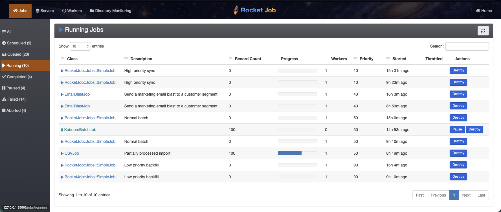

It ships as a separate gem,
[`rocketjob_mission_control`](https://github.com/reidmorrison/rocketjob_mission_control),
so the web UI and its Rails dependencies are not loaded everywhere Rocket Job jobs are
defined or run. Workers stay lean, and the console runs wherever it is convenient to host a
small Rails app.

### A quick orientation

If you are new to Rocket Job, a handful of terms show up throughout this interface:

* A **Job** is a unit of work. It moves through a lifecycle of states (queued, running,
  completed, failed, and so on) that Mission Control groups into tabs. See the
  [Programmers Guide](guide.html).
* A **Batch Job** splits a large amount of data into many small **slices** that are
  processed in parallel and independently. A single bad record fails only its slice, not the
  whole job, which is what makes the recovery tools below possible. See
  [Batch Processing](batch.html).
* A **Server** is one running Rocket Job process. Each server runs one or more **Workers**,
  the threads that actually pull jobs off the queue and process them. See
  [Architecture](architecture.html).
* A **Dirmon Entry** is a rule that watches a directory and starts a job whenever a matching
  file arrives. See the [Dirmon guide](dirmon.html).

The top navigation bar mirrors these concepts with four sections: **Jobs**, **Servers**,
**Workers**, and **Directory Monitoring**. The rest of this page walks through each one.

### Installation

Mission Control is a Rails engine. Mount it into a new or existing Rails application.

Add it to the `Gemfile`:

~~~ruby
gem "rocketjob_mission_control", "~> 6.0"
~~~

Install it:

~~~bash
bundle install
~~~

Mount the engine in `config/routes.rb`, pointing it at whatever path you want it served
from:

~~~ruby
Rails.application.routes.draw do
  mount RocketJobMissionControl::Engine => "rocketjob"
end
~~~

The application that hosts Mission Control needs the same Mongoid configuration as the
rest of the cluster (the `rocketjob` and `rocketjob_slices` clients) so that it reads and
writes the same jobs and slices. See [Installation](installation.html) for the Mongoid
setup.

Because it only needs `railties` and not a full Rails stack, Mission Control can be mounted
into a minimal app dedicated to operations. It exposes destructive actions (aborting jobs,
stopping servers, editing slice data), so put it behind your own authentication and
authorization before exposing it outside a trusted network. The next section covers the
built-in authorization.

### Access control

Mission Control authenticates nothing itself; the host app is responsible for identifying
the user. What Mission Control does provide is fine-grained **authorization**: deciding which
of its actions a given user is allowed to perform.

Authorization is built on the
[access-granted](https://github.com/chaps-io/access-granted) gem, a lightweight,
policy-based, role-driven authorization library. A few of its concepts are worth knowing
before tuning the rules:

* **Policy.** A single policy object holds all the rules. Mission Control ships one,
  `RocketJobMissionControl::AccessPolicy`, whose `configure` method defines every role.
* **Roles.** Permissions are grouped into named roles rather than scattered through
  conditionals. A user is granted one or more roles and inherits the permissions those roles
  allow.
* **Whitelist model.** Rules say what a role *can* do; anything not explicitly granted is
  denied. There are no sprawling "allow this, but not that" exceptions to reason about.
* **Priority ordering.** Roles are evaluated top to bottom. The most privileged role sits at
  the top, and the first role that grants a permission wins, so checks stay fast and
  predictable.
* **Conditional permissions.** A permission can carry a block that further scopes it, for
  example restricting a user to acting only on their own jobs.

#### The default roles

Mission Control defines seven roles over the `RocketJob::Job`, `RocketJob::DirmonEntry`,
`RocketJob::Server`, and `RocketJob::Worker` documents:

| Role | Grants |
| --- | --- |
| `admin` | Create and destroy jobs; destroy Dirmon entries. |
| `editor` | View, edit, and update the data inside a batch job's slices, including encrypted records. |
| `operator` | Stop, kill, pause, resume, and destroy servers; destroy zombies; request thread dumps. |
| `manager` | Edit, pause, resume, retry, abort, fail, update, and run jobs now. |
| `dirmon` | Create, edit, update, copy, replicate, enable, and disable Dirmon entries. |
| `user` | Edit, pause, resume, retry, abort, and update jobs, but only the user's own jobs (where the job's `login` matches). |
| `view` | Read-only access to jobs, Dirmon entries, servers, and workers. |

Roles are **hierarchical**. They are ordered from most to least privileged (`admin`,
`editor`, `operator`, `manager`, `dirmon`, `user`, `view`), and granting a role also grants
every role below it. So an `admin` can do everything, a `manager` also gets `dirmon`, `user`,
and `view` permissions, and a `view` user gets read-only access and nothing more.

The `user` role is special: its permissions are scoped by a `login`, so a user granted that
role can only act on jobs whose `login` matches their own. Supply the current user's login
from the configuration callback described below.

**When no authorization is configured, every request is treated as a full `admin`.** This
keeps development friction-free, and makes wiring up your own authorization an opt-in step.
Configure it before exposing Mission Control beyond a trusted network.

### Configuration

Authorization is wired up with a single callback in an initializer in the host application,
for example `config/initializers/rocket_job_mission_control.rb`:

~~~ruby
RocketJobMissionControl::Engine.config.rocket_job_mission_control.authorization_callback =
  lambda do
    {
      roles: current_user.rocket_job_roles, # e.g. [:manager, :dirmon]
      login: current_user.email
    }
  end
~~~

The callback:

* Returns a hash with `roles` (an array of role names from the table above) and, optionally,
  a `login` used to scope the `user` role.
* Is evaluated in the controller instance (`instance_exec`), so it can read `session`,
  `request`, and any `current_user`-style helper your authentication layer provides. This is
  how per-request, per-user roles are computed.
* Returning an empty `roles` array grants no permissions (read nothing, do nothing), which is
  the safe default for an unauthenticated request.

Supplying an unknown role name raises an `ArgumentError`, so typos surface immediately rather
than silently granting or denying access.

To change the permissions themselves rather than who receives which role, supply your own
policy class. Define a class that includes `AccessGranted::Policy` (subclassing the shipped
`RocketJobMissionControl::AccessPolicy` is the easiest starting point) and point the engine
at it:

~~~ruby
class MyAccessPolicy < RocketJobMissionControl::AccessPolicy
  def configure
    super # keep the built-in roles, then add or override below

    role :auditor do
      can :read, RocketJob::Job
    end
  end
end

RocketJobMissionControl::Engine.config.rocket_job_mission_control.access_policy_class =
  MyAccessPolicy
~~~

`access_policy_class` accepts either the class itself or a String naming it (for example
`"MyAccessPolicy"`), which avoids autoloading the class too early from an initializer. When
it is not set, Mission Control uses `RocketJobMissionControl::AccessPolicy`. Because
access-granted is a plain authorization library, the same `role`/`can` API shown in the
shipped policy is all a custom policy needs.

### Monitoring jobs

The interface opens on the list of running jobs, newest first. Each entry shows:

* The class name of the job.
* An icon indicating the job's state.
* A duration that means different things depending on state:
    * **Completed:** how long the job took to run.
    * **Queued:** how long it has been waiting.
    * **Running:** how long it has been processing.
    * **Failed or aborted:** how long it ran before it stopped.
* For running jobs, a progress bar showing percent complete.

Jobs are grouped by state, each on its own tab in the left sidebar:

* **Running** is the default view.

  

* **Scheduled** lists jobs set to run in the future, including recurring
  [Cron jobs](guide.html). Select **Run** on any scheduled job to run it immediately
  instead of waiting for its next scheduled time.

  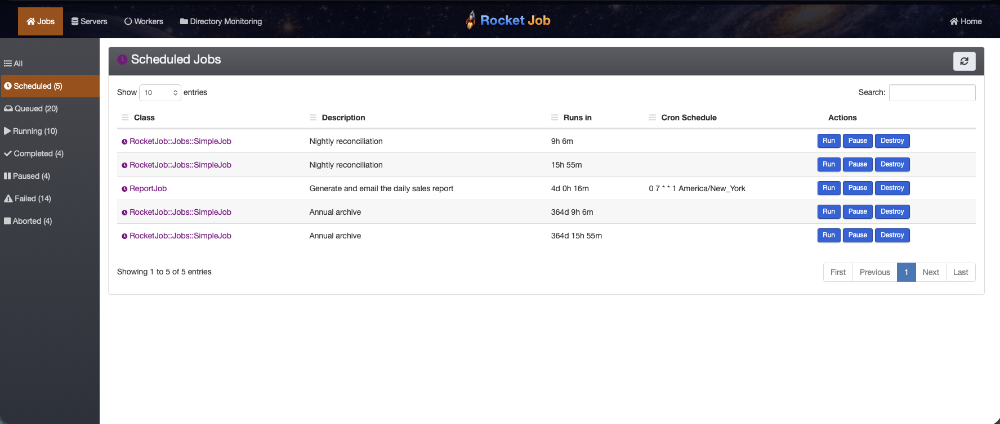

* **Queued** lists jobs waiting for a free worker.

  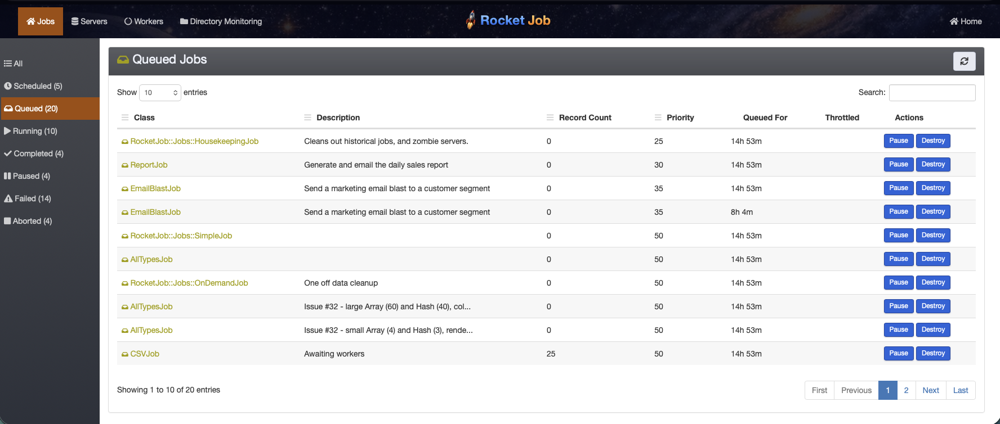

* **Completed** lists finished jobs. Only jobs with `destroy_on_complete == false` are kept
  and shown here; by default completed jobs delete themselves.

  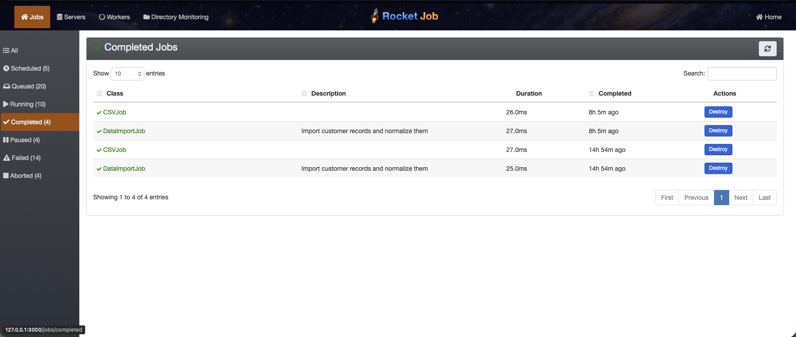

* **Paused** lists jobs whose processing has been temporarily stopped.

  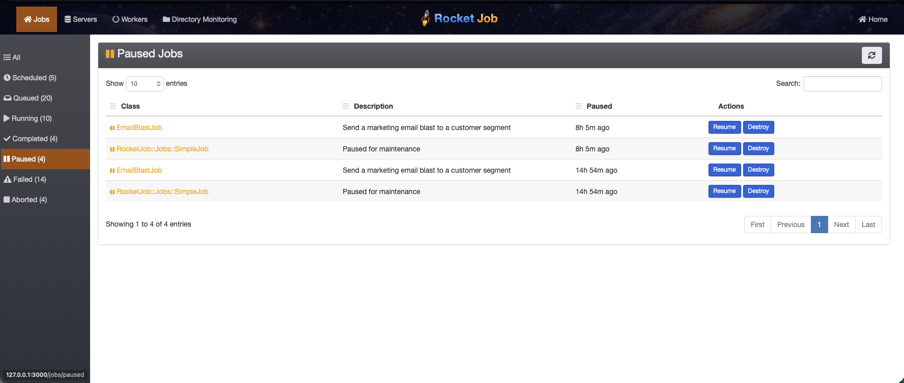

* **Failed** lists jobs that raised an exception. The failure, including the backtrace, is
  recorded on the job so it can be inspected and retried.

  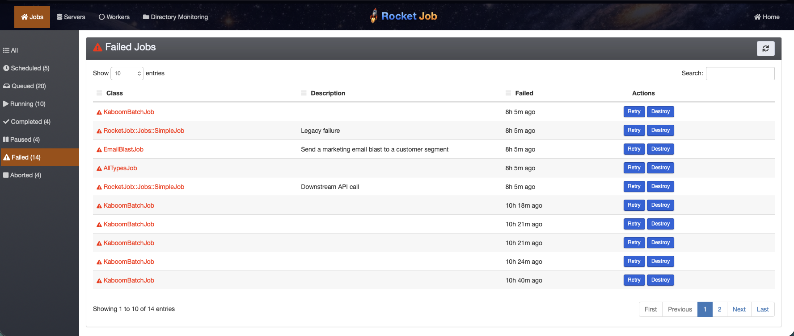

* **Aborted** lists jobs that were stopped and cannot be retried.

  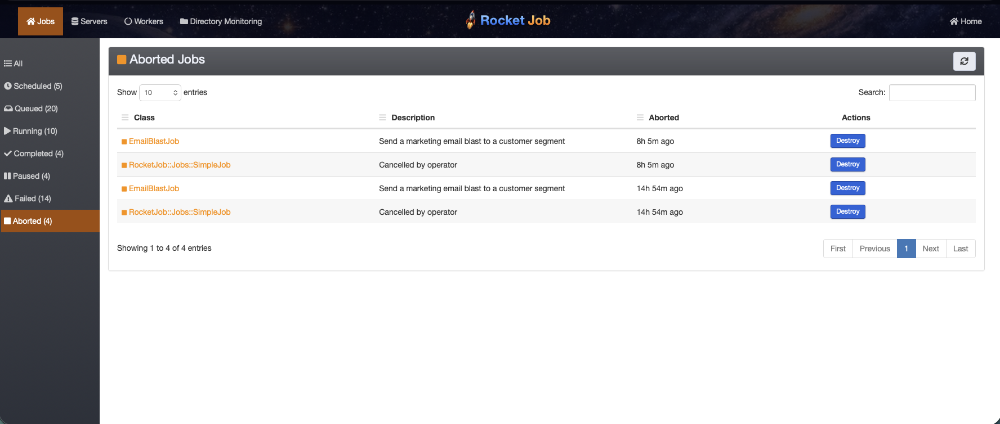

The **All** tab lists every job regardless of state, with a search box for finding a
specific job by class or description. The valid actions for each job (Retry, Pause, Destroy,
and so on) are available inline, so common operations can be done without opening the job.

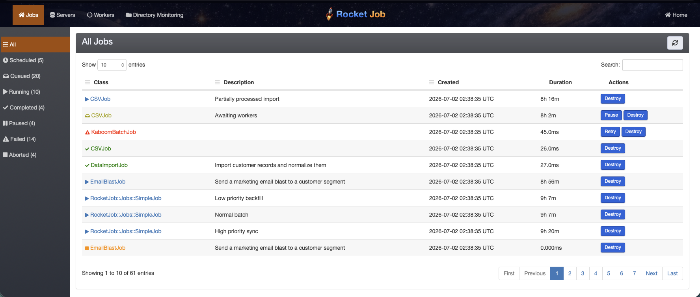

### Managing a job

Select any job to open its detail page. It shows the job's current state, its fields and
timing, and the actions that are valid for its current state. For a
[batch job](batch.html), the **Details** panel also shows the record count, progress,
estimated time remaining, and a **Slices** bar that breaks the work down into queued,
active, failed, and completed slices at a glance.

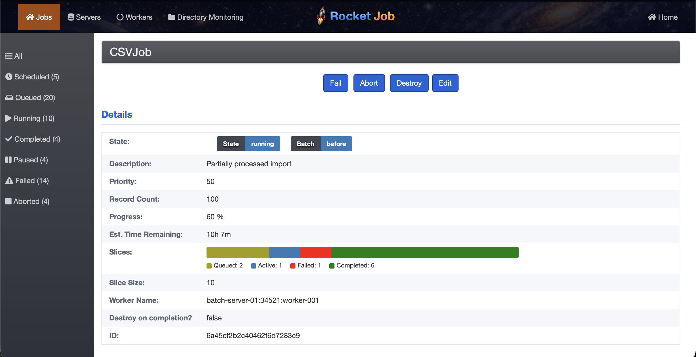

The available actions are:

* **Retry** restarts a failed job from where it left off. For [batch jobs](batch.html) only
  the unprocessed and failed slices are run again, so retrying a large job does not reprocess
  records that already succeeded.
* **Pause** temporarily stops a running or queued job; it resumes only when **Resume** is
  selected. Batch jobs can be paused mid-flight because they are pre-empted between slices.
  A simple (non-batch) job is only checked between runs, so pausing one does not interrupt a
  `#perform` that is already in progress.
* **Resume** continues a paused job.
* **Fail** stops a running or queued job and marks it failed. A failed job can be retried
  later.
* **Abort** stops a running or queued job permanently; an aborted job cannot be retried.
  Aborting or failing a batch job cleans up its input and output slice collections.
* **Destroy** removes the job from the system entirely.

A failed job shows the captured exception so the cause can be diagnosed before retrying. The
**Slices** bar turns solid red when every slice has failed, which is a quick signal that the
failure is systemic rather than caused by a few bad records.

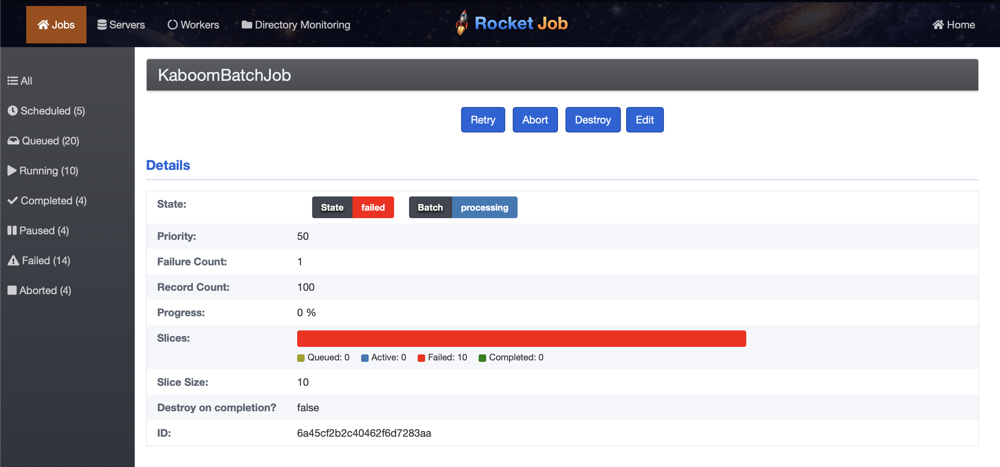

### Recovering a failed batch job

When a [batch job](batch.html) fails, the problem is often a handful of bad records rather
than the whole data set. Because each slice fails independently, Mission Control lets you
find the offending records, fix or remove them, and retry, all without rerunning the records
that already succeeded.

The failed job's detail page includes an **Exceptions** section that groups the failures by
exception class and lists the messages raised. This is the fastest way to tell whether every
slice failed for the same reason or for several different ones.

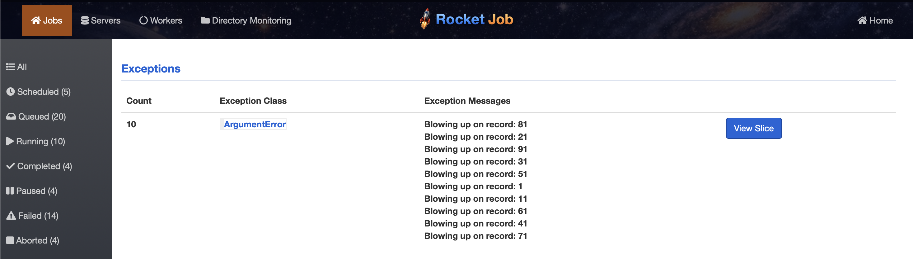

Select an exception class to open its detail page. It shows the class name, message, and the
record number that triggered the failure, along with the backtrace (with a **Full Backtrace**
toggle for the complete stack). The arrows at the top step through the other failed
exceptions on the job.

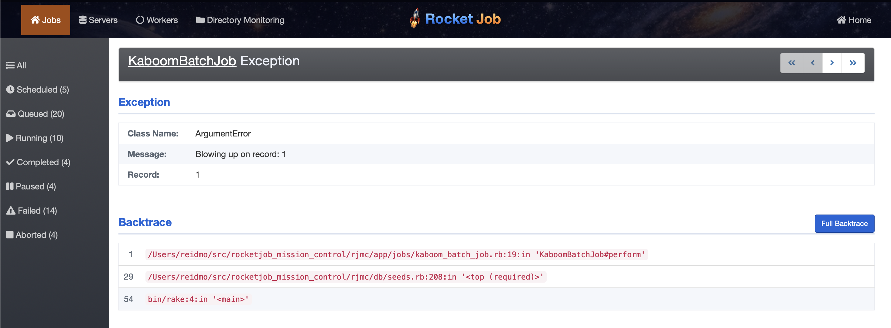

Select **View Slice** to see the actual records in the failed slice. The record that raised
the exception is highlighted, and every record has an **Edit** button.

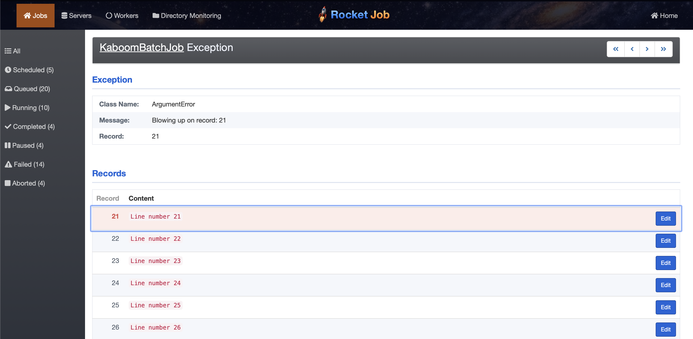

Editing a record opens it in a text area. Correct the data and select **Save** to put the
repaired record back into the slice, or select **Delete** to drop a record that should not
be processed at all. Unprintable bytes are shown as `\xHH` escapes (for example a null byte
as `\x00`) and are converted back to the original bytes when saved, so binary and oddly
encoded data can be edited safely.

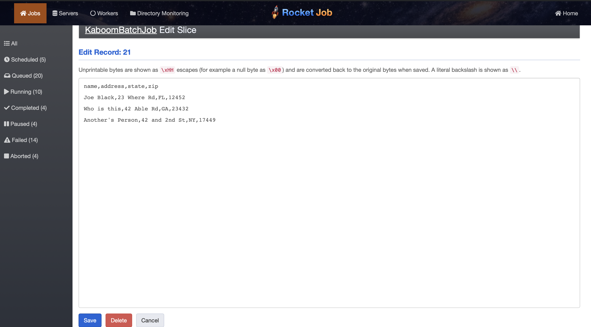

Once the bad records are fixed or removed, **Retry** the job. Only the previously failed and
unprocessed slices run again, so the job finishes without redoing the records that already
succeeded.

### Monitoring workers

The **Workers** view lists every active worker across the cluster and the job each one is
currently processing. Each row shows the worker name (in `hostname:pid:worker-NNN` form), the
job class it is running (linked to that job), the job's description, and how long the worker
has been on its current work. It is the quickest way to see whether the cluster is busy and
where its capacity is going right now.

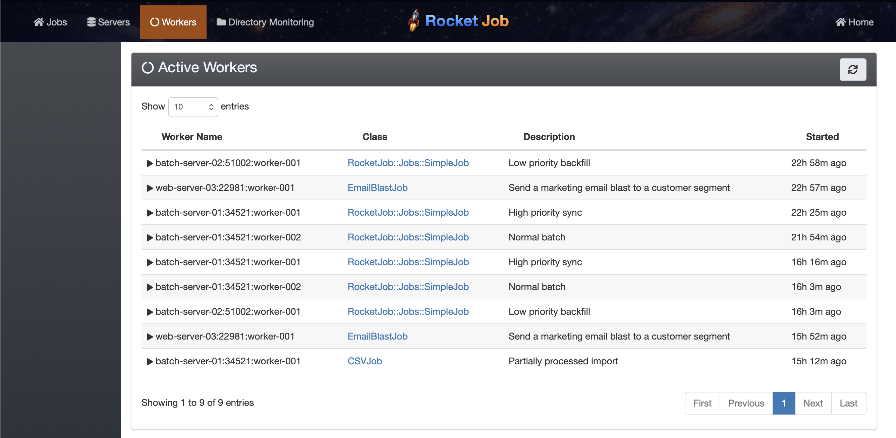

Because a single server runs many workers, the same server name appears on several rows when
it is processing several jobs at once. Use the refresh control at the top right to re-read the
current state.

### Managing servers

The **Servers** view lists the running Rocket Job server processes (each `Server` is one
running process; see [Architecture](architecture.html)), grouped in the sidebar by state:
starting, running, paused, stopping, and zombie. Each row shows the hostname and PID, the
current and maximum worker counts, when the server started, and when it last checked in.

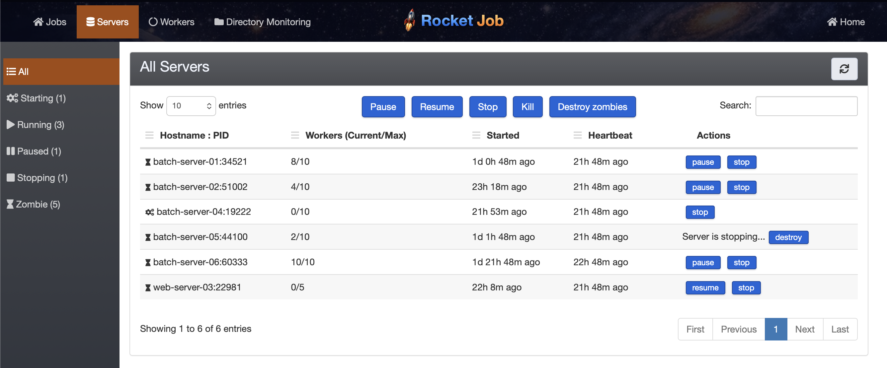

Servers can be controlled from here without shell access to the hosts:

* **Pause** / **Resume** an individual server to stop or restart it pulling new work.
* **Stop** an individual server to shut it down gracefully.
* **Pause All**, **Resume All**, and **Stop All** apply the same actions to every server at
  once, which is useful for draining the cluster before a deploy and bringing it back
  afterward.

These actions are delivered to the servers over Rocket Job's MongoDB-backed
[pub/sub mechanism](events.html), so they take effect across every process in the cluster
without a separate message broker.

#### Zombie servers

Every server writes a periodic heartbeat. A server that stops checking in, usually because
its process was terminated abnormally rather than shut down gracefully, is flagged as a
**zombie** so dead processes can be spotted and cleaned up.

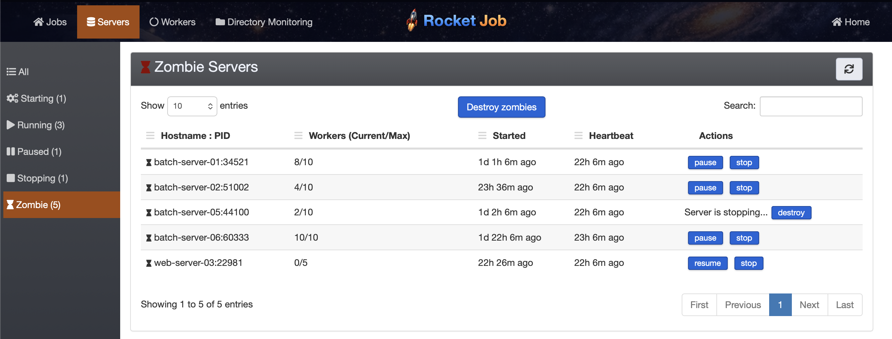

Zombies matter because a job that was being processed by a server that died would otherwise
sit stalled. Rocket Job's `HousekeepingJob` watches for zombie servers and re-queues any jobs
they were processing so another worker can pick them up. You can also clear them by hand:
**Destroy zombies** removes all of them at once, or use the per-row action to destroy a
single one.

### Managing directory monitors

Mission Control includes a full management screen for [Dirmon](dirmon.html), Rocket Job's
directory monitor. A Dirmon entry watches a path pattern and starts a job whenever a matching
file appears, so the files and schedules a system reacts to can be changed from the web UI
without a code deploy.

The **Directory Monitoring** view lists every entry with its name, job class, and the file
pattern it watches. Entries are grouped in the sidebar by state (pending, enabled, failed,
disabled), and each entry's name is colored and icon-tagged by its state.

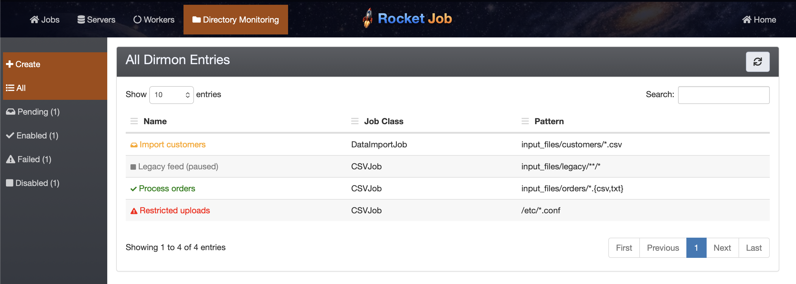

Select **Create** to add a new entry. At minimum an entry needs a name, the job class to
start, and a pattern (a glob such as `input_files/orders/*.{csv,txt}`) identifying the files
to watch. An optional archive directory tells Rocket Job where to move each file after it has
been queued. The **properties** button reveals the job's own fields so their default values
can be set on the entry.

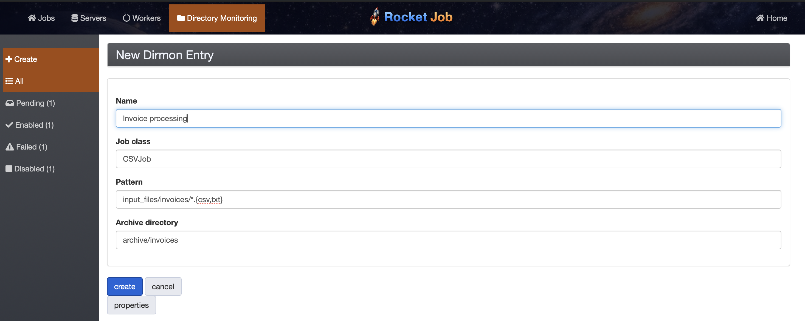

Selecting an entry opens its detail page, showing its current state, job class, pattern,
archive directory, and any job properties. From here an entry can be enabled or disabled,
edited, copied to a new entry, or destroyed.

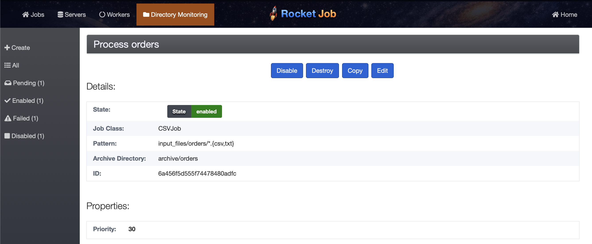

Editing works the same way as creating, on the same form. A **failed** entry, one whose last
run raised an error, can be corrected here and re-enabled in place.

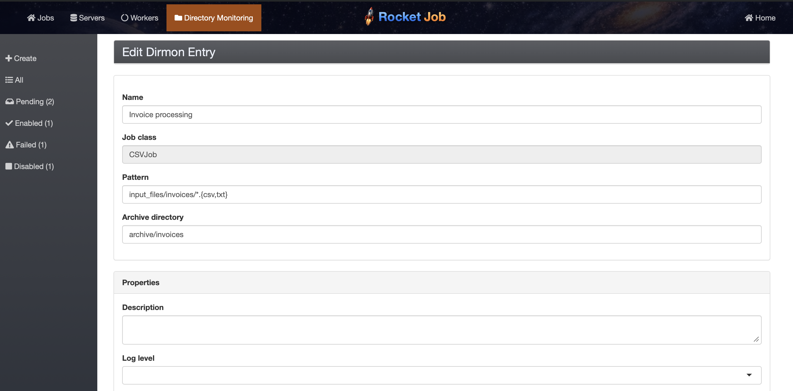

See the [Dirmon guide](dirmon.html) for what each field controls and how patterns and
archiving behave.
